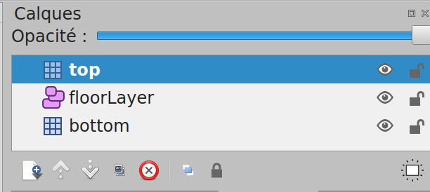
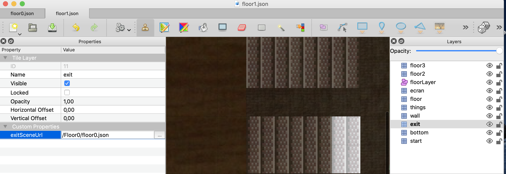

# Work Adventure

## Work in progress

Work Adventure is a web-based collaborative workspace for small to medium teams (2-100 people) presented in the form of a
16-bit video game.

In Work Adventure, you can move around your office and talk to your colleagues (using a video-chat feature that is
triggered when you move next to a colleague).


## Getting started

Install Docker.

Run:

```
docker-compose up
```

The environment will start.

You should now be able to browse to http://workadventure.localhost/ and see the application.

Note: on some OSes, you will need to add this line to your `/etc/hosts` file:

**/etc/hosts**
```
workadventure.localhost 127.0.0.1
```

## Designing a map

If you want to design your own map, you can use [Tiled](https://www.mapeditor.org/).

A few things to notice:

- your map can have as many layers as your want
- your map MUST contain a layer named "floorLayer" of type "objectgroup" that represents the layer on which characters will be drawn.
- the tilesets in your map MUST be embedded. You can refer to an external typeset in a TSX file. Click the "embed tileset" button in the tileset tab to embed tileset data.
- your map MUST be exported in JSON format. You need to use a recent version of Tiled to get JSON format export (1.3+)



In order to place an on your scene that leads to another scene:

- You must create an specific layer. When a character reaches ANY tile of that layer, it will exit the scene.
- In layer properties, you must add "exitSceneUrl" property. It represents the map URL of the next scene. For example : `/<map folder>/<map>.json`. Be careful, if you want the next map to be correctly loaded, you must check that the map files are in folder `back/src/Assets/Maps/<your map folder>`. The files will be accessible by url `<HOST>/map/files/<your map folder>/...`.
- If you want to have multiple exits, you can create many layers with name "exit". Each layer has a different key `exitSceneUrl` and have tiles that represent exits to another scene.



### MacOS developers, your environment with Vagrant

If you are using MacOS, you can increase Docker performance using Vagrant. If you want more explanations, you can read [this medium article](https://medium.com/better-programming/vagrant-to-increase-docker-performance-with-macos-25b354b0c65c).

#### Prerequisites

- VirtualBox*	5.x	Latest version	https://www.virtualbox.org/wiki/Downloads
- Vagrant	2.2.7	Latest version	https://www.vagrantup.com/downloads.html

#### First steps

Create a config file `Vagrantfile` from `Vagrantfile.template`

```bash
cp Vagrantfile.template Vagrantfile
```

In `Vagrantfile`, update `VM_HOST_PATH` with the local project path of your machine.

```
#VM_HOST_PATH# => your local machine path to the project

```

(run `pwd` and copy the path in this variable)

To start your VM Vagrant, run:

```bash
Vagrant up
```

To connect to your VM, run:


```bash
Vagrant ssh
```

To start project environment, run

```bash
docker-compose up
```

You environment runs in you VM Vagrant. When you want stop your VM, you can run:

````bash
Vagrant halt
````

If you want to destroy, you can run

````bash
Vagrant destroy
````

#### Available commands

* `Vagrant up`: start your VM Vagrant.
* `Vagrant reload`: reload your VM Vagrant when you change Vagrantfile.
* `Vagrant ssh`: connect on your VM Vagrant.
* `Vagrant halt`: stop your VM Vagrant.
* `Vagrant destroy`: delete your VM Vagrant.

## Features developed
You have more details of features developed in back [README.md](./back/README.md).
