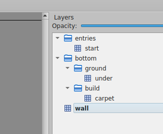
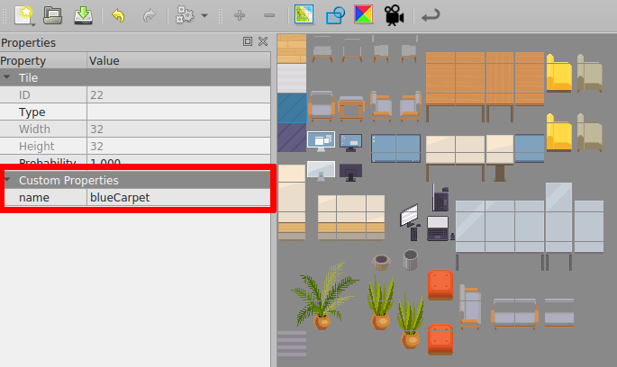

# Room

### Working with group layers

If you use group layers in your map, to reference a layer in a group you will need to use a `/` to join layer names
together.

Example :



The name of the layers of this map are :

- `entries/start`
- `bottom/ground/under`
- `bottom/build/carpet`
- `wall`

### Detecting when the user enters/leaves a layer

```ts
WA.room.onEnterLayer(name: string): Subscription
WA.room.onLeaveLayer(name: string): Subscription
```

Listens to the position of the current user. The event is triggered when the user enters or leaves a given layer.

- **name**: the name of the layer who as defined in Tiled.

Example:

```ts
const myLayerSubscriber = WA.room.onEnterLayer("myLayer").subscribe(() => {
  WA.chat.sendChatMessage("Hello!", "Mr Robot");
});

WA.room.onLeaveLayer("myLayer").subscribe(() => {
  WA.chat.sendChatMessage("Goodbye!", "Mr Robot");
  myLayerSubscriber.unsubscribe();
});
```

### Show / Hide a layer

```ts
WA.room.showLayer(layerName : string): void
WA.room.hideLayer(layerName : string) : void
```

These 2 methods can be used to show and hide a layer. if `layerName` is the name of a group layer, show/hide all the
layer in that group layer.

Example :

```ts
WA.room.showLayer("bottom");
//...
WA.room.hideLayer("bottom");
```

### Set/Create properties in a layer

```ts
WA.room.setProperty(layerName : string, propertyName : string, propertyValue : string | number | boolean | undefined) : void;
```

Set the value of the `propertyName` property of the layer `layerName` at `propertyValue`. If the property doesn't exist,
create the property `propertyName` and set the value of the property at `propertyValue`.

Note :
To unset a property from a layer, use `setProperty` with `propertyValue` set to `undefined`.

Example :

```ts
WA.room.setProperty("wikiLayer", "openWebsite", "https://www.wikipedia.org/");
```

### Working with area objects
You can use Tiled objects of special class `area` to hold various properties, instead of layers. They, too, can be modified with scripting API.

### Create Area

```ts
WA.room.area.create(area: {
    name: string,   // Name of the area (must be unique)
    x: number,      // X position
    y: number,      // Y position
    width: number,  // Width size
    height: number, // Height size
}): Area;
```

You can create new Area object (currently limited to rectangular shapes).

Example:
```ts
const area = WA.room.area.create({
    name: 'MyNewArea',
    x: 100,
    y: 100,
    width: 320,
    height: 320,
});
```

### Get an Area
```ts
WA.room.area.get(name: string): Promise<Area>;
```

It is possible to get an existing Area object.

```ts
const area = await WA.room.area.get('MyNewArea');
```

### Modify Area

It is possible to modify already existing Area object (currently limited to x, y, width, height).

```ts
const area = await WA.room.area.get('MyNewArea');
if (area) {
    area.x = 150;
    area.y = 150;
}
```

### Delete Area

You can delete Area if it has a name.

```ts
WA.room.area.delete('MyNewArea');
```

### Detecting when the user enters/leaves an area

```ts
WA.room.area.onEnter(name: string): Subscription
WA.room.area.onLeave(name: string): Subscription
```

Listens to the position of the current user. The event is triggered when the user enters or leaves a given area.

- **name**: the name of the area as defined in Tiled.

Example:

```ts
const myAreaSubscriber = WA.room.area.onEnter("myArea").subscribe(() => {
  WA.chat.sendChatMessage("Hello!", "Mr Robot");
});

WA.room.area.onLeave("myArea").subscribe(() => {
  WA.chat.sendChatMessage("Goodbye!", "Mr Robot");
  myAreaSubscriber.unsubscribe();
});
```

### Set/Create properties in an Area object

```ts
setProperty(propertyName : string, propertyValue : string | number | boolean | undefined) : void;
```

Set the value of the `propertyName` property of the area at `propertyValue`. If the property doesn't exist,
create the property `propertyName` and set the value of the property at `propertyValue`.

Note :
To unset a property from an area, use `setProperty` with `propertyValue` set to `undefined`.

Example :

```ts
const area = await WA.room.area.get('wikiArea');
area.setProperty("openWebsite", "https://www.wikipedia.org/");
```

### Get the room id

```ts
WA.room.id: string;
```

The ID of the current room is available from the `WA.room.id` property.

:::info
You need to wait for the end of the initialization before accessing `WA.room.id`
:::

```ts
WA.onInit().then(() => {
  console.log("Room id: ", WA.room.id);
  // Will output something like: 'https://play.workadventu.re/@/myorg/myworld/myroom', or 'https://play.workadventu.re/_/global/mymap.org/map.json"
});
```

### Get the map URL

```ts
WA.room.mapURL: string;
```

The URL of the map is available from the `WA.room.mapURL` property.

:::info
You need to wait for the end of the initialization before accessing `WA.room.mapURL`
:::

```ts
WA.onInit().then(() => {
  console.log("Map URL: ", WA.room.mapURL);
  // Will output something like: 'https://mymap.org/map.json"
});
```

### Getting map data

```ts
WA.room.getTiledMap(): Promise<ITiledMap>
```

Returns a promise that resolves to the JSON map file.

```ts
const map = await WA.room.getTiledMap();
console.log("Map generated with Tiled version ", map.tiledversion);
```

Check
the [Tiled documentation to learn more about the format of the JSON map](https://doc.mapeditor.org/en/stable/reference/json-map-format/)
.

### Get the URL hash parameters

```ts
WA.room.hashParameters: Record<string, string>;
```

The parameters passed in the hash (#) are available in `WA.room.hashParameters` property.
Use this to pass parameters from the URL to your script.

:::info
You need to wait for the end of the initialization before accessing `WA.room.hashParameters`
:::

```ts
// If the URL is https://play.workadventu.re/_/global/mymap.org/map.json#myparam=hello

WA.onInit().then(() => {
  console.log("Map URL: ", WA.room.hashParameters.myparam);
  // Will output something like: 'hello"
});
```

### Changing tiles

```ts
WA.room.setTiles(tiles: TileDescriptor[]): void
```

Replace the tile at the `x` and `y` coordinates in the layer named `layer` by the tile with the id `tile`.

If `tile` is a string, it's not the id of the tile but the value of the property `name`.



`TileDescriptor` has the following attributes :

- **x (number) :** The coordinate x of the tile that you want to replace.
- **y (number) :** The coordinate y of the tile that you want to replace.
- **tile (number | string) :** The id of the tile that will be placed in the map.
- **layer (string) :** The name of the layer where the tile will be placed.

**Important !** : If you use `tile` as a number, be sure to add the `firstgid` of the tileset of the tile that you want
to the id of the tile in Tiled Editor.

Note: If you want to unset a tile, use `setTiles` with `tile` set to `null`.

Example :

```ts
WA.room.setTiles([
  { x: 6, y: 4, tile: "blue", layer: "setTiles" },
  { x: 7, y: 4, tile: 109, layer: "setTiles" },
  { x: 8, y: 4, tile: 109, layer: "setTiles" },
  { x: 9, y: 4, tile: "blue", layer: "setTiles" },
]);
```

### Loading a tileset

```ts
WA.room.loadTileset(url: string): Promise<number>
```

Load a tileset in JSON format from an url and return the id of the first tile of the loaded tileset.

You can create a tileset file in Tile Editor.

```ts
WA.room.loadTileset("Assets/Tileset.json").then((firstId) => {
  WA.room.setTiles([{ x: 4, y: 4, tile: firstId, layer: "bottom" }]);
});
```

## Embedding websites in a map

You can use the scripting API to embed websites in a map, or to edit websites that are already embedded (using
the ["website" objects](/map-building/tiled-editor/website-in-map)).

### Getting an instance of a website already embedded in the map

```ts
WA.room.website.get(objectName: string): Promise<EmbeddedWebsite>
```

You can get an instance of an embedded website by using the `WA.room.website.get()` method. It returns a promise of
an `EmbeddedWebsite` instance.

```ts
// Get an existing website object where 'my_website' is the name of the object (on any layer object of the map)
const website = await WA.room.website.get("my_website");
website.url = "https://example.com";
website.visible = true;
```

### Adding a new website in a map

```ts
WA.room.website.create(website: CreateEmbeddedWebsiteEvent): EmbeddedWebsite

interface CreateEmbeddedWebsiteEvent {
    name: string;       // A unique name for this iframe
    url: string;        // The URL the iframe points to.
    position: {
        x: number,      // In "game" pixels, relative to the map or player coordinates, depending on origin
        y: number,      // In "game" pixels, relative to the map or player coordinates, depending on origin
        width: number,  // In "game" pixels
        height: number, // In "game" pixels
    },
    visible?: boolean,  // Whether to display the iframe or not
    allowApi?: boolean, // Whether the scripting API should be available to the iframe
    allow?: string,     // The list of feature policies allowed
    origin: "player" | "map" // The origin used to place the x and y coordinates of the iframe's top-left corner, defaults to "map"
    scale: number, // A ratio used to resize the iframe
}
```

You can create an instance of an embedded website by using the `WA.room.website.create()` method. It returns
an `EmbeddedWebsite` instance.

```ts
// Create a new website object
const website = WA.room.website.create({
  name: "my_website",
  url: "https://example.com",
  position: {
    x: 64,
    y: 128,
    width: 320,
    height: 240,
  },
  visible: true,
  allowApi: true,
  allow: "fullscreen",
  origin: "map",
  scale: 1,
});
```

### Deleting a website from a map

```ts
WA.room.website.delete(name: string): Promise<void>
```

Use `WA.room.website.delete` to completely remove an embedded website from your map.

### The EmbeddedWebsite class

Instances of the `EmbeddedWebsite` class represent the website displayed on the map.

```ts
class EmbeddedWebsite {
  readonly name: string;
  url: string;
  visible: boolean;
  allow: string;
  allowApi: boolean;
  x: number; // In "game" pixels, relative to the map or player coordinates, depending on origin
  y: number; // In "game" pixels, relative to the map or player coordinates, depending on origin
  width: number; // In "game" pixels
  height: number; // In "game" pixels
  origin: "player" | "map";
  scale: number;
}
```

When you modify a property of an `EmbeddedWebsite` instance, the iframe is automatically modified in the map.

:::caution
The websites you add/edit/delete via the scripting API are only shown locally. If you want them
to be displayed for every player, you can use [variables](api-start.md) to share a common state between all users.
:::
