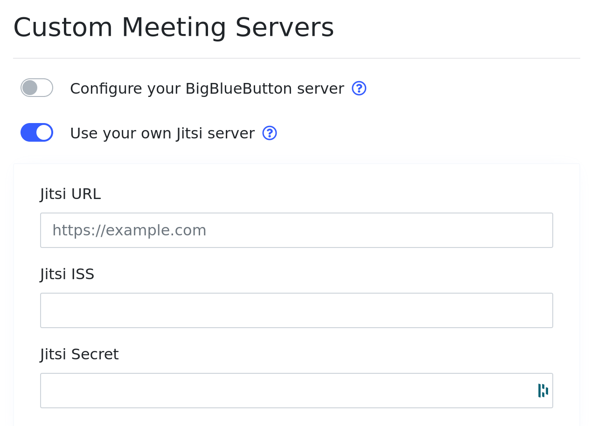
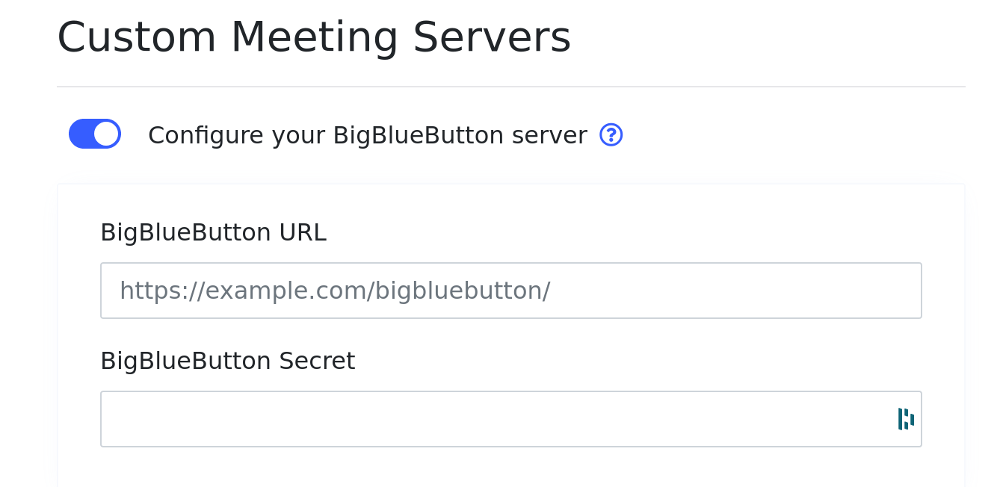

---

sidebar_position: 50
title: Meeting rooms

---

# Meeting rooms with Jitsi

<iframe width="100%" height="480" src="https://www.youtube.com/embed/cN9VMWHN0eo" title="Building your map - Meeting room" frameborder="0" allow="accelerometer; autoplay; clipboard-write; encrypted-media; gyroscope; picture-in-picture; web-share; fullscreen" allowfullscreen></iframe>

## Opening a Jitsi meet when walking on the map

On your map, you can define special zones (meeting rooms) that will trigger the opening of a Jitsi meet. When a player will pass over these zones, a Jitsi meet will open (as an iframe on the right side of the screen)

In order to create Jitsi meet zones:

* You must create a specific object.
* Object must be of class "`area`"
* In object properties, you MUST add a "`jitsiRoom`" property (of type "`string`"). The value of the property is the name of the room in Jitsi. Note: the name of the room will be "slugified" and prepended with a hash of the room URL
* You may also use "jitsiWidth" property (of type "number" between 0 and 100) to control the width of the iframe containing the meeting room.

You can have this object (i.e. your meeting area) to be selectable as the precise location for your meeting using the [Google Calendar integration for Work Adventure](/integrations/google-calendar). To do so, you must set the `meetingRoomLabel` property. You can provide any name that you would like your meeting room to have (as a string).

:::info
As an alternative, you may also put the `jitsiRoom` properties on a layer (rather than putting them on an "area" object)
but we advise to stick with "area" objects for better performance!
:::

## Triggering of the "Jitsi meet" action

By default, Jitsi meet will open when a user enters the area defined on the map.

It is however possible to trigger Jitsi only on user action. You can do this with the `jitsiTrigger` property.

If you set `jitsiTrigger: onaction`, when the user walks on the area, an alert message will be displayed at the bottom of the screen:


<div class="text--center text--italic">Jitsi meet will only open if the user clicks Space</div>

If you set `jitsiTriggerMessage: your message action` you can edit alert message displayed. If is not defined, the default message displayed is 'Press on SPACE to enter in jitsi meet room'.

## Prevent Jitsi meet from being closable

If you wish your meeting to not be closable by a close button, you can make use of `openWebsiteClosable` property and set it to `false`.

## Customizing your "Jitsi meet"

Your Jitsi meet experience can be customized using Jitsi specific config options. The `jitsiConfig` and `jitsiInterfaceConfig` properties can be used on the Jitsi object to change the way Jitsi looks and behaves. Those 2 properties are accepting a JSON string.

For instance, use `jitsiConfig: { "startWithAudioMuted": true }` to automatically mute the microphone when someone enters a room. Or use `jitsiInterfaceConfig: { "DEFAULT_BACKGROUND": "#77ee77" }` to change the background color of Jitsi.

The `jitsiConfig` property will override the Jitsi [config.js](https://github.com/jitsi/jitsi-meet/blob/master/config.js) file

The `jitsiInterfaceConfig` property will override the Jitsi [interface_config.js](https://github.com/jitsi/jitsi-meet/blob/master/interface_config.js) file

:::warning Troubleshooting
If your customizations are not working:
 * First, check that the JSON you are entering is valid. Take a look at the console in your browser. If the JSON string is invalid, you should see a warning.
 * Then, check that the JSON you are using is matching the version of Jitsi used.
:::

## Granting moderator controls in Jitsi

:::info
Moderator controls are linked to member tags. You need a pro account to edit member tags.
:::

You can grant moderator rights to some of your members. Jitsi moderators can:

*   Publish a Jitsi meeting on Youtube Live (you will need a Youtube Live account)
*   Record a meeting to Dropbox (you will need a Dropbox account)
*   Mute someone
*   Mute everybody except one speaker
*   Kick users out of the meeting

All users with the "admin" tag are moderators.

In order to grant moderator rights to users with other tags, you can add a `jitsiRoomAdminTag` property to your Jitsi object. For instance, if you write a property:

    jitsiRoomAdminTag: speaker

then, any of your member with the `speaker` tag will be automatically granted moderator rights over this Jitsi instance.

You can read more about [managing member tags in the admin documentation](/admin/members).

## Using another Jitsi server

### SAAS version

If you are using the online version at `workadventu.re`, we are handling a Jitsi meet cluster for you. In the very specific case where you would like to use your own Jitsi server, you can configure the Jitsi credentials to your third-party vendor in the world edit form.



<div class="text--center text--italic">Screenshot of world edit page</div>

Please note that the Jitsi server you are using MUST be configured to [support JWT authentication](https://github.com/jitsi/lib-jitsi-meet/blob/master/doc/tokens.md).

### Self-hosted version

WorkAdventure usually comes with a default Jitsi meet installation. If you are using the online version at `workadventu.re`, we are handling a Jitsi meet cluster for you. If you are running the self-hosted version of WorkAdventure, the administrator probably set up a Jitsi meet instance too.

You have the possibility, in your map, to override the Jitsi meet instance that will be used by default. This can be useful for regulatory reasons. Maybe your company wants to keep control on the video streams and therefore, wants to self-host a Jitsi instance? Or maybe you want to use a very special configuration or very special version of Jitsi?

Use the `jitsiUrl` property to in the Jitsi object to specify the Jitsi instance that should be used. Beware, `jitsiUrl` takes in parameter a **domain name**, without the protocol. So you should use:
`jitsiUrl: meet.jit.si`
and not
`jitsiUrl: https://meet.jit.si`

:::info
When you use `jitsiUrl`, the targeted Jitsi instance must be public. You cannot use moderation features or the JWT
tokens authentication with maps configured using the `jitsiUrl` property.
:::

## Full control over the Jitsi room name

By default, the name of the room will be "slugified" and prepended with a hash of the room URL.
This is what you want most of the time. Indeed, different maps with the same Jitsi room name (the same `jitsiRoom` property) will not share the same Jitsi room instance.

However, sometimes, you may actually want to have different WorkAdventure meeting rooms that are actually sharing
the same Jitsi meet meeting room. Or if you are pointing to a custom Jitsi server (using the `jitsiUrl` property),
you may want to point to a specific existing room.

For all those use cases, you can use `jitsiNoPrefix: true`. This will remove the automatic prefixing
of the hash and will give you full control on the Jitsi room name.

# Meeting rooms with BigBlueButton

## Opening a BigBlueButton session when walking on the map

The same concept of Jitsi rooms is applied to BigBlueButton rooms. When a player pass over the BigBlueButton special zone, a BigBlueButton session will open (as an iframe on the right side of the screen).

In order to create a BigBlueButton session zone:

* You must create a specific object.
* Object must be of class "`area`"
* In object properties:
  * You MUST add a "`bbbMeeting`" property (of type "`string`"). The value of this property will be used to calculate the meetingID of the BigBlueButton room. We suggest you to use [a random UUID](https://www.uuidgenerator.net/version4).
  * You CAN add a "`meetingName`" property (of type "`string`"). The value of this property will be used as `meetingName` of the BigBlueButton room. If you do not set it, `meetingName` will be the same as `meetingID`.
  * You CAN add "`userdata-`" properties (of type "`string`"). They will be passed in the JOIN API call on BigBlueButton, and will allow you to customize UI settings on BigBlueButton. These are a few properties you can set::
    * `userdata-bbb_auto_share_webcam=true`: webcam will be shared automatically
    * `userdata-bbb_hide_presentation=true`: presentation will be minimized and webcams will use the whole space
    * `userdata-bbb_listen_only_mode=false`: microphone will be enabled for audio and listen only mode won't be used
    * `userdata-bbb_skip_check_audio=true`: echo test when enabling microphone won't be displayed
    * `userdata-bbb_skip_video_preview=true`: webcam preview won't be displayed before sharing
    * `userdata-bbb_show_participants_on_login=false`: users list won't be displayed

:::info
All participants join BigBlueButton as moderators.
:::

## Granting moderator controls in Big Blue Button

:::info
By default, all users are moderators. If you want to configure who gets moderator controls, you will need to configure tags. You need a pro account to edit member tags.
:::

In order to grant moderator rights to users with other tags, you can add a `bbbMeetingAdminTag` property to your BBB object. For instance, if you write a property:

    bbbMeetingAdminTag: speaker

then, any of your member with the `speaker` tag will be automatically granted moderator rights over this BBB instance.

Furthermore, all users with the "admin" tag are moderators.

If you do not pass any `bbbMeetingAdminTag` property, everybody can moderate the BBB meeting room.

You can read more about [managing member tags in the admin documentation](/admin/members).

## Configuring your BigBlueButton server

### SAAS version

As of now, your WorkAdventure online subscription does not come with a Big Blue Button account. You will therefore have
to get this from a third-party vendor. You can configure the Big Blue Button credentials to your third-party vendor
in world edit form.



<div class="text--center text--italic">Screenshot of world edit page</div>

### Self-hosted version

WorkAdventure will come configured with test BigBlueButton credentials, provided by [Blindside Networks](https://blindsidenetworks.com) as default server for testing integrations.

You will configure your BigBlueButton credentials on the back component. In order to get your URL and secret, log in your BigBlueButton server and type `bbb-conf --secret`. The answer will look like this:

```
$ bbb-conf --secret

    URL: https://YOUR-SERVER/bigbluebutton/
    Secret: YOUR-SECRET

    Link to the API-Mate:
    https://mconf.github.io/api-mate/#server=https://YOUR-SERVER/bigbluebutton/&sharedSecret=YOUR-SECRET
```

You'll set the following environment variables with URL and secret:
```
BBB_URL: YOUR-SERVER
BBB_SECRET: YOUR-SECRET
```

:::info
Make sure BBB_URL ends with `/bigbluebutton/`.
:::
