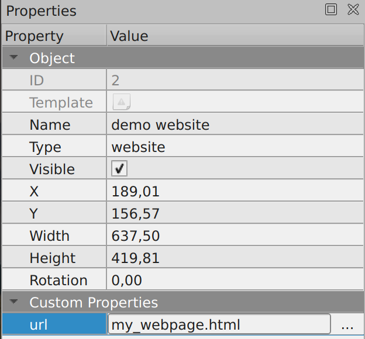

---

sidebar_position: 80
title: Integrated websites

---

# Putting a website inside a map

You can inject a website directly into your map, at a given position.

To do this in Tiled:

- Select an object layer
- Create a rectangular object, at the position where you want your website to appear
- Add a `url` property to your object pointing to the URL you want to open

The `url` can be absolute, or relative to your map.

:::info
Internally, WorkAdventure will create an "iFrame" to load the website.
Some websites forbid being opened by iframes using the [`X-Frame-Options](https://developer.mozilla.org/en-US/docs/Web/HTTP/Headers/X-Frame-Options)
HTTP header.
:::

:::caution
Please note that the website always appears **on top** of the tiles (even if you put the object layer that
contains the "website" object under the tiles).
:::

## Allowing the scripting API in your iframe

If you are planning to use the WorkAdventure scripting API inside your iframe, you need
to explicitly allow it, by setting an additional `allowApi` property to `true`.

A "website" object that can communicate using the Iframe API

### Setting the iFrame "allow" attribute

By default, iFrames have limited rights in browsers. For instance, they cannot put their content in fullscreen, they cannot start your webcam, etc...

If you want to grant additional access rights to your embedded iFrame, you should use the `policy` property. The value of this property will be directly used for the [`allow` atttribute of your iFrame](https://developer.mozilla.org/en-US/docs/Web/HTTP/Feature_Policy/Using_Feature_Policy#the_iframe_allow_attribute).

For instance, if you want an iFrame to be able to go in fullscreen, you will use the property `policy: fullscreen`
