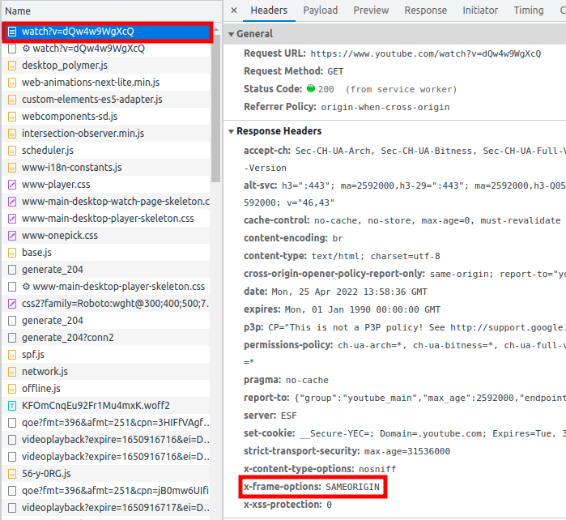

# Troubleshooting

## Look at the browser console

If your map is not displayed correctly (most notably if you are getting a black screen), open your browser console.
This is usually done by pressing the F12 key and selecting the "console" tab.

Scan the output. Towards the end, you might see a message explaining why your map cannot be loaded.

## Check webserver CORS settings

If you are hosting the map you built on your own webserver and if the map does not load, please check that 
[your webserver CORS settings are correctly configured](hosting.md).

## Issues embedding a website

When you are embedding a website in WorkAdventure (whether it is using the [`openWebsite` property](opening-a-website.md) or
the [integrated website in a map](website-in-map.md) feature or the [Scripting API](scripting.md)), WorkAdventure
will open your website using an iFrame.

Browsers have various security measures in place, and website owners can use those measures to prevent websites from 
being used inside iFrames (either partially or completely).

In the chapters below, we will list what can possibly prevent you from embedding a website, and see what are your options.

### Embedding an iFrame is forbidden

The worst that can happen is that the website you are trying to embed completely denies you the authorisation.
A website owner can do that using the [`X-Frame-Options` HTTP header](https://developer.mozilla.org/en-US/docs/Web/HTTP/Headers/X-Frame-Options),
or the newer [`Content-Security-Policy` HTTP header](https://developer.mozilla.org/en-US/docs/Web/HTTP/Headers/Content-Security-Policy).

Take a look at the headers of the page you are trying to load.

{.alert.alert-info}
You can view the headers of the web page you try to load in the developer tools of your browser (usually accessible using the F12 key
of your keyboard), in the network tab. Click on the top-most request and check the "Response Headers".

Below is what you can see when opening a Youtube video page:

`X-Frame-Options: DENY` or `X-Frame-Options: SAMEORIGIN` will prevent WorkAdventure from loading the page.
`Content-Security-Policy` header have also the potential to prevent WorkAdventure from loading the page.

If the website you are trying to embed has one of these headers set, here are your options:

- if you have control over the website or know the owner, you can contact the owner/administrator of the website and ask for an exception
- otherwise, you can look for an "embed" option. Some websites have special pages that can be embedded. For instance,
  YouTube has special "embed" links that can be used to embed a video in your website. A lot of websites have the same feature (you
  can usually find those links in the "share" section)

If none of these options are available to you, as a last resort, you can use the [`openTab` property](opening-a-website.md) instead of the `openWebsite` property.
It will open your webpage in another tab instead of opening it in an iFrame.

### I cannot log into my embedded website

When you log into a website, the website is issuing a "cookie". The cookie is a unique identifier that allows the website
to recognize you and to identify you. To improve the privacy of their users, browsers can sometimes treat cookies
inside iFrames as "third-party cookies" and discard them.

Cookies can come with a `SameSite` attribute.

The `SameSite` attribute can take these values: "Lax", "Strict" or "None". The only value that allows using the
cookie inside an iFrame is "None".

{.alert.alert-info}
The `SameSite` attribute of your cookie MUST be set to "None" if you want to be able to use this cookie from an iFrame inside WorkAdventure.

**Default values**:

If the "SameSite" attribute is not explicitly set, [the behaviour depends on the browser](https://developer.mozilla.org/en-US/docs/Web/HTTP/Headers/Set-Cookie/SameSite#browser_compatibility).
Chrome, Edge and Opera will default to "Lax".
Firefox and Safari will default to "None" (as of 2022/04/25).

As a result, a website that does not set the `SameSite` attribute on cookies will work correctly in Firefox and Safari but 
login will fail on Chrome, Edge and Opera.

If the website you are trying to embed has the `SameSite` attribute set to a value other than "None", here are your options:

- if you have control over the website or know the owner, you can contact the owner/administrator of the website and ask
  the owner/administrator to change the `SameSite` settings.
- otherwise, you will have to use the [`openTab` property](opening-a-website.md) instead of the `openWebsite` property.
  It will open your webpage in another tab instead of in an iFrame.

## Need some help?

        
WorkAdventure is a constantly evolving project and there is plenty of room for improvement regarding map editing.

        
If you are facing any troubles, do not hesitate to seek help in 
            <a href="https://discord.gg/G6Xh9ZM9aR">our Discord server</a> or open an "issue" in the
            <a href="https://github.com/thecodingmachine/workadventure/issues" target="_blank">GitHub WorkAdventure account</a>.
        

