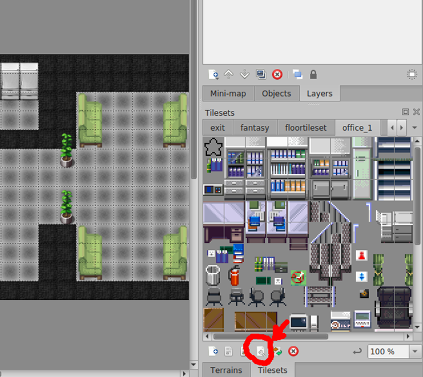
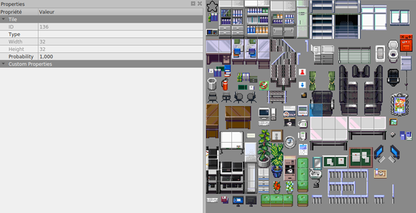
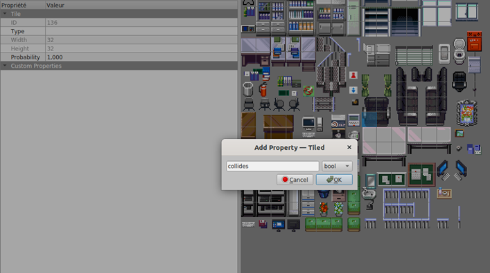
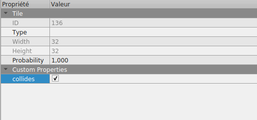
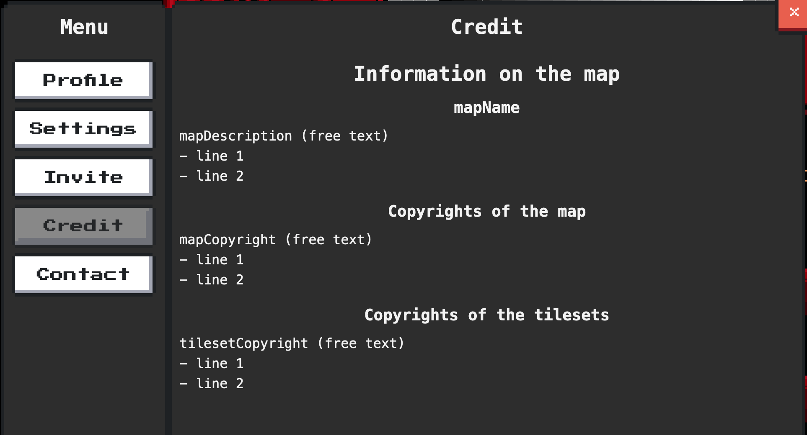

{.section-title.accent.text-primary}
# About WorkAdventure maps

A WorkAdventure map is a map in "JSON" format generated by [Tiled](https://www.mapeditor.org/).

## Tiles

A map is made of "tiles" (we can also call them "sprites"). In WorkAdventure, the tiles are small images of 32x32 pixels.

Tiles may have transparent parts. Many tiles can be stored in a single PNG file. We call this file a "tileset".

There are many tilesets available on the internet. Some examples of websites offering awesome tiles:

*   [itch.io](https://itch.io/)
*   [opengameart.org](https://opengameart.org/)
*   [deviantart.com](https://www.deviantart.com/)

Keep in mind the size of tiles and do not forget to check the license of the tileset you are using!

## How to design "pixel" tiles

You can design your own tiles as well as change existing tiles, this is usually referred to as "pixeling". You can start drawing your own tiles with [Piskel](https://www.piskelapp.com/). It is easy to use and well targeted at "pixeling". If you are getting serious about pixeling, the awesome folks at the Chaos Computer Club recommend the use of the editor [Krita](https://krita.org/). There are plenty of other editors as well.

If you are using Krita:

*   Please double check that your tiles are 32x32 pixels in size. You can enable a grid under view -> show grid and under settings -> dockers -> grid you can select the grid size.
*   Use transparency if you have to model transitions between different materials. This is more flexible and saves you time by not modeling every transition.
*   You can follow the Pixel-Art Workshop by blinry: [media.ccc.de/v/34C3-jugend-hackt-1016-pixel_art_workshop](https://media.ccc.de/v/34C3-jugend-hackt-1016-pixel_art_workshop)

## WorkAdventure Map Rules

In order to design a map that will be readable by WorkAdventure, you will have to respect some constraints.

In particular, you will need to:

*   set a start position for the players
*   configure the "floor layer" (so that WorkAdventure can correctly display characters above the floor, but under the ceiling)
*   eventually, you can place exits that link to other maps

A few things to notice:

*   your map can have as many layers as you want
*   your map MUST contain a layer named "floorLayer" of type "objectgroup" that represents the layer on which characters will be drawn. Every layer above the "floorLayer" will be displayed on top of the characters.
*   the tilesets in your map MUST be embedded. You cannot refer to an external typeset in a TSX file. Click the "embed tileset" button in the tileset tab to embed tileset data.
*   your map MUST be exported in JSON format. You need to use a recent version of Tiled to get JSON format export (1.3+)
*   WorkAdventure doesn't support object layers and will ignore them
*   If you are starting from a blank map, your map MUST be orthogonal and tiles size should be 32x32.

    <figure class="figure">
        
        <figcaption class="figure-caption">"floorLayer" is compulsory</figcaption>
    </figure>

## Building walls and "collidable" areas

[Building your map - Collides](https://www.youtube.com/watch?v=qTK50ymhMIE)

By default, the characters can traverse any tiles. If you want to prevent your character from going through a tile (like a wall or a desktop), you must make this tile "collidable". You can do this by settings the `collides` property on a given tile.

To make a tile "collidable", you should:

1.  select the relevant tileset and switch to "edit" mode:
    
    {.document-img}
    
2.  right click on a tile of the tileset to select it:

    {.document-img}
    
3.  on the left pane in the custom properties section, right click and select "Add properties":

    {.document-img}

    Please add a `collides` property. The type of the property must be **bool**.

4.  finally, check the checkbox for the `collides` property:

    {.document-img}

Repeat for every tile that should be "collidable".

## Adding behaviour with properties

In the next sections, you will see how you can add behaviour on your map by adding "properties".
You can add properties for a variety of features: putting exits, opening websites, meeting rooms, silent zones, etc...

You can add properties either on individual tiles of a tileset OR on a complete layer.

If you put a property on a layer, it will be triggered if your Woka walks on any tile of the layer.

The exception is the "collides" property that can only be set on tiles, but not on a complete layer.

## Insert helpful information in your map

By setting properties on the map itself, you can help visitors know more about the creators of the map.

The following *map* properties are supported:
* `mapName` (string)
* `mapDescription` (string)
* `mapCopyright` (string)

And *each tileset* can also have a property called `tilesetCopyright` (string). 

Resulting in a "credit" page in the menu looking like this:

{.document-img}

